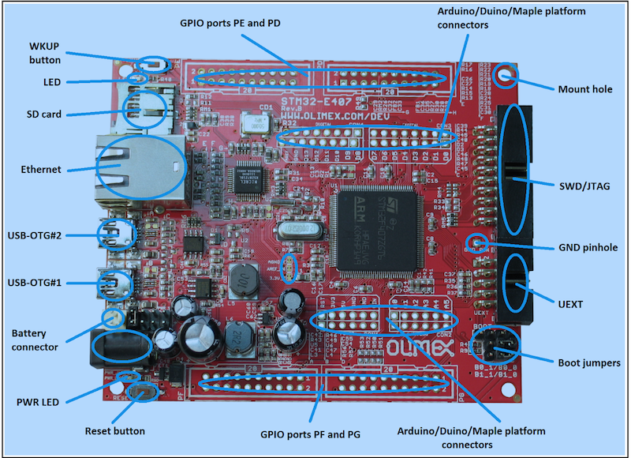

## Run Blinky from SRAM without bootloader

### Objective

To download an application image directly into the embedded SRAM in the microcontroller and run it without the bootloader. This tutorial describes how you do it on an Olimex STM32 board.

### What you need

1. STM32-E407 development board from Olimex. You can order it from [http://www.mouser.com](http://www.mouser.com/ProductDetail/Olimex-Ltd/STM32-E407/?qs=UN6GZl1KCcit6Ye0xmPO4A%3D%3D), [http://www.digikey.com](http://www.digikey.com/product-detail/en/STM32-E407/1188-1093-ND/3726951), and other places.
2. ARM-USB-TINY-H connector with JTAG interface for debugging ARM microcontrollers (comes with the ribbon cable to hook up to the board)
3. USB A-B type cable to connect the debugger to your personal computer
4. Personal Computer with Mac OS (Mac: OS X Yosemite Version 10.10.5) or Linux box (Ubuntu 14.10: Utopic Unicorn)
5. An account on Github repository and *git* installed on your computer.
6. It is assumed you have already installed newt tool. 
7. It is assumed you already installed native tools as described [here](../get_started/native_tools.md)

Also, we assume that you're familiar with UNIX shells. Let's gets started!

<br>


### Prepare the Software

* Make sure the PATH environment variable includes the $HOME/dev/go/bin directory. 
 
<br>

### Create a project  

Create a new project to hold your work.  For a deeper understanding, you can read about project creation in 
[Get Started -- Creating Your First Project](../get_started/project_create.md)
or just follow the commands below.

```no-highlight
    $ mkdir ~/dev
    $ cd ~/dev
    $ newt new myproj
    Downloading project skeleton from apache/incubator-mynewt-blinky...
    Installing skeleton in myproj...
    Project myproj successfully created.

    $cd myproj

    $ newt install -v 
    apache-mynewt-core
    Downloading repository description for apache-mynewt-core... success!
    ...
    apache-mynewt-core successfully installed version 0.7.9-none
``` 

<br>
   
### Create a target

Change directory to ~/dev/myproj directory and define the *blinky* target inside myproj, using the *newt* tool. Starting with the target name, assign specific aspects of the project, as shown below, to pull the appropriate packages and build the right bundle or list for the board. For example, we set the build_profile, board support package (bsp), and app.


```no-highlight
    $ newt target create blinky
    $ newt target set blinky build_profile=debug
    $ newt target set blinky bsp=@apache-mynewt-core/hw/bsp/olimex_stm32-e407_devboard
    $ newt target set blinky app=apps/blinky
    $ newt target show blinky
    targets/blinky
        app=apps/blinky
        bsp=hw/bsp/olimex_stm32-e407_devboard
        build_profile=debug
```

<br>

### Build the image

Next, let's build the image for the above target. By default, the linker script within the `hw/bsp/olimex_stm32-e407_devboard` package builds an image for flash memory, which we don't want; instead, we want an image for the SRAM, so you need to switch that script with `run_from_sram.ld`. 

Afer you build the target, you can find the executable *blinky.elf* in the project directory *~/dev/myproj/bin/blinky/apps/blinky/.* 
    
    
```no-highlight
    $ cd ~/dev/myproj/repos/apache-mynewt-core/hw/bsp/olimex_stm32-e407_devboard/
    $ diff olimex_stm32-e407_devboard.ld run_from_sram.ld
    (some diff will be displayed)
    $ cp run_from_sram.ld olimex_stm32-e407_devboard.ld
    $ cd ~/dev/myproj
    $ newt build blinky
    Compiling case.c
    Compiling suite.c
    ...
    Linking blinky.elf
    App successfully built:~/dev/myproj/bin/blinky/apps/blinky/blinky.elf
    $ ls ~/dev/myproj/bin/blinky/apps/blinky/
        blinky.elf      blinky.elf.bin     blinky.elf.cmd  
        blinky.elf.lst  blinky.elf.map
```

<br>

### Prepare the hardware to boot from embedded SRAM

* Locate the boot jumpers on the board.

<br>




<br>

* B1_1/B1_0 and B0_1/B0_0 are PTH jumpers. Note that because the markings on the board may not always be accurate, when in doubt, you should always refer to the manual for the correct positioning. Since the jumpers are a pair, they should move together, and as such, the pair is responsible for the boot mode when bootloader is present. 
To locate the bootloader, the board searches in three places: User Flash Memory, System Memory or the Embedded SRAM. For this Blinky project, we will configure it to boot from SRAM by jumpering **B0_1** and **B1_1**.

* Connect USB-OTG#2 in the picture above to a USB port on your computer (or a powered USB hub to make sure there is enough power available to the board). 

* The red PWR LED should be lit. 

* Connect the JTAG connector to the SWD/JTAG interface on the board. The other end of the cable should be connected to the USB port or hub of your computer.

<br>

### Let's Go!

* Ensure that you are in the blinky project directory with the *blinky.elf* executable. Run the debug command in the *newt* tool. You'll see some status messages as shown below. In case you need to halt the debugging session, you can issue an `-c "reset halt"` command.


```no-highlight
    $ newt debug blinky
    Debugging with ~/dev/core/hw/bsp/olimex_...
    Debugging ~/dev/core/project/blinky/bin/blinky/blinky.elf
    GNU gdb (GNU Tools for ARM Embedded Processors) 7.8.0.20150604-cvs
    Copyright (C) 2014 Free Software Foundation, Inc.
    License GPLv3+: GNU GPL version 3 <http://gnu.org/licenses/gpl.html>
    ...
    (info)
    ...
    target state: halted
    target halted due to debug-request, current mode: Thread 
    xPSR: 0x01000000 pc: 0x080003c0 msp: 0x10010000
    Info : accepting 'gdb' connection on tcp/3333
    Info : device id = 0x10036413
    Info : flash size = 1024kbytes
```
<br>

Check the value of the msp (main service pointer) register. If it is not 0x10010000 as indicated above, you will have to manually set it after you open the gdb tool and load the image on it. For example, 
   
```no-highlight
    (gdb) set $msp=0x10010000
```

<br>

   Now load the image and type "c" or "continue" from the GNU debugger. 

```no-highlight           
    (gdb) load ~/dev/myproj/bin/blinky/apps/blinky/blinky.elf   
    Loading section .text, size 0x16b88 lma 0x20000000
    Loading section .ARM.exidx, size 0x18 lma 0x20016b88
    Loading section .data, size 0x9ec lma 0x20016ba0
    Start address 0x200004b8, load size 95628
    Transfer rate: 74 KB/sec, 3825 bytes/write.
    (gdb) c
    Continuing.
```   
      
* Voilà! The board's LED should be blinking at 1 Hz. Success!

<br>

