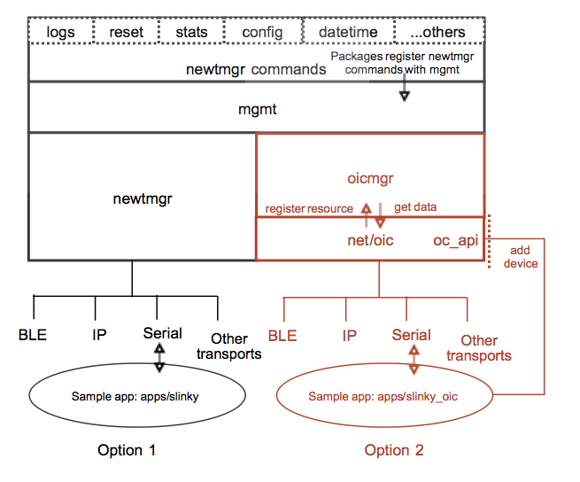

## Newt Manager

Newt Manager is the protocol that enables your Mynewt application to communicate remotely with your device running the Mynewt OS in order to configure, manage, conduct maintenance, and monitor it. The core device management module is called `mgmt` and offers multiple options for invoking the appropriate newt manager commands for various operations on the device e.g. enabling and collecting logs, configuring and retrieving stats, resetting the device etc. 

1. Use the `newtmgr` package if reduced code footprint is your primary requirement and you do not have interoperability requirements upstream for device information, discovery, and connectivity.
2. Use the `oicmgr` package if interoperability and standards-based connectivity for device interaction is your primary requirement. This package supports the OIC (Open Interconnect Consortium) Specification 1.1.0 framework from Open Connectivity Foundation (OCF). 

### Invoking Newt Manager commands

The diagram below indicates the two options available to the application developer to issue Newt Manager (`newtmgr`) commands on a Mynewt device. The application may leverage the `newtmgr` framework or the `oicmgr` framework to call the newtmgr commands. The latter is described in the next chapter.

### newtmgr

The newtmgr framework uses a simple request and response message format to send commands to the device.  A message 
consists of an eight byte header and the message payload.  The message header specifies the newtmgr command. 
The message payload contains the newtmgr request/response data and is encoded in 
CBOR (Concise Binary Object Representation) format.  newtmgr supports BLE and serial connections.

The newtmgr framework has a smaller code size and memory footprint than oicmgr but does not support open connectivity.
