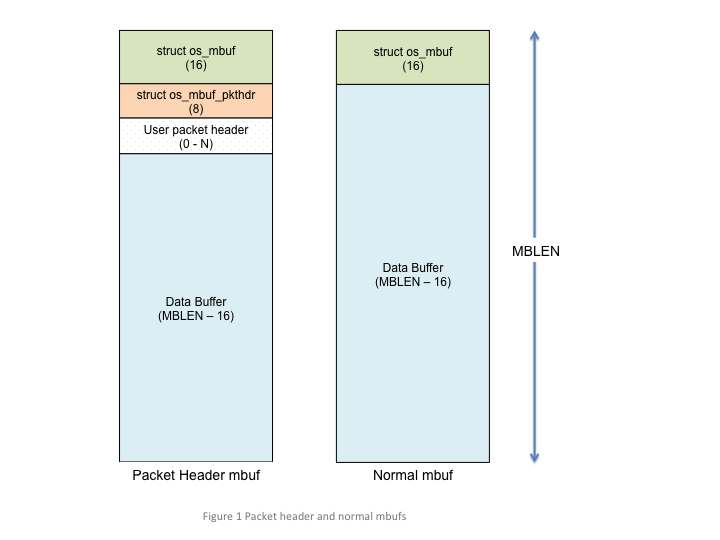
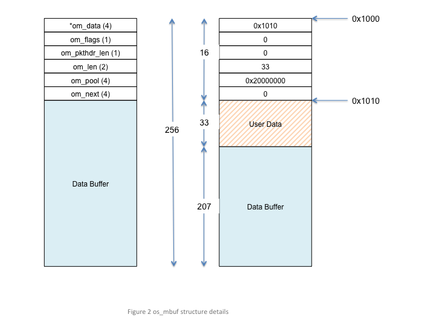
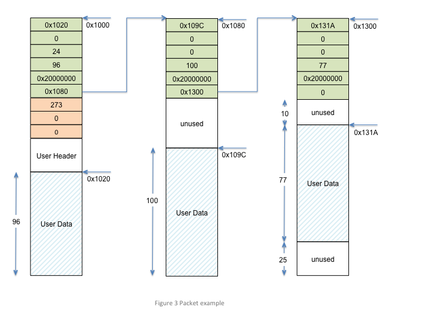

# Mbufs

The mbuf (short for memory buffer) is a common concept in networking stacks. The mbuf is used to hold packet data as it traverses the stack. The mbuf also generally stores header information or other networking stack information that is carried around with the packet. The mbuf and its associated library of functions were developed to make common networking stack operations (like stripping and adding protocol headers) efficient and as copy-free as possible.

In its simplest form, an mbuf is a memory block with some space reserved for internal information and a pointer which is used to "chain" memory blocks together in order to create a "packet". This is a very important aspect of the mbuf: the ability to chain mbufs together to create larger "packets" (chains of mbufs).

### Why use mbufs? 

The main reason is to conserve memory. Consider a networking protocol that generally sends small packets but occasionally sends large ones. The Bluetooth Low Energy (BLE) protocol is one such example. A flat buffer would need to be sized so that the maximum packet size could be contained by the buffer. With the mbuf, a number of mbufs can be chained together so that the occasional large packet can be handled while leaving more packet buffers available to the networking stack for smaller packets.

### Packet Header mbuf

Not all mbufs are created equal. The first mbuf in a chain of mbufs is a special mbuf called a "packet header mbuf". The reason that this mbuf is special is that it contains the length of all the data contained by the chain of mbufs (the packet length, in other words). The packet header mbuf may also contain a user defined structure (called a "user header") so that networking protocol specific information can be conveyed to various layers of the networking stack. Any mbufs that are part of the packet (i.e. in the mbuf chain but not the first one) are "normal" (i.e. non-packet header) mbufs. A normal mbuf does not have any packet header or user packet header structures in them; they only contain the basic mbuf header (`struct os_mbuf`). Figure 1 illustrates these two types of mbufs. Note that the numbers/text in parentheses denote the size of the structures/elements (in bytes) and that MBLEN is the memory block length of the memory pool used by the mbuf pool.



### Normal mbuf 

Now let's take a deeper dive into the mbuf structure. Figure 2 illustrates a normal mbuf and breaks out the various fields in the `os_mbuf` structure. 

* The *om_data* field is a pointer to where the data starts inside the data buffer. Typically, mbufs that are allocated from the mbuf pool (discussed later) have their om_data pointer set to the start of the data buffer but there are cases where this may not be desirable (added a protocol header to a packet, for example). 
* The *om_flags* field is a set of flags used internally by the mbuf library. Currently, no flags have been defined. 
* The *om_pkthdr_len* field is the total length of all packet headers in the mbuf. For normal mbufs this is set to 0 as there is no packet or user packet headers. For packet header mbufs, this would be set to the length of the packet header structure (16) plus the size of the user packet header (if any). Note that it is this field which differentiates packet header mbufs from normal mbufs (i.e. if *om_pkthdr_len* is zero, this is a normal mbuf; otherwise it is a packet header mbuf). 
* The *om_len* field contains the amount of user data in the data buffer. When initially allocated, this field is 0 as there is no user data in the mbuf. 
* The *omp_pool* field is a pointer to the pool from which this mbuf has been allocated. This is used internally by the mbuf library. 
* The *omp_next* field is a linked list element which is used to chain mbufs.

Figure 2 also shows a normal mbuf with actual values in the `os_mbuf` structure. This mbuf starts at address 0x1000 and is 256 bytes in total length. In this example, the user has copied 33 bytes into the data buffer starting at address 0x1010 (this is where om_data points). Note that the packet header length in this mbuf is 0 as it is not a packet header mbuf.



Figure 3 illustrates the packet header mbuf along with some chained mbufs (i.e a "packet"). In this example, the user header structure is defined to be 8 bytes. Note that in figure 3 we show a number of different mbufs with varying *om_data* pointers and lengths since we want to show various examples of valid mbufs. For all the mbufs (both packet header and normal ones) the total length of the memory block is 128 bytes.



### Mbuf pools

Mbufs are collected into "mbuf pools" much like memory blocks. The mbuf pool itself contains a pointer to a memory pool. The memory blocks in this memory pool are the actual mbufs; both normal and packet header mbufs. Thus, the memory block (and corresponding memory pool) must be sized correctly. In other words, the memory blocks which make up the memory pool used by the mbuf pool must be at least: sizeof(struct os_mbuf) + sizeof(struct os_mbuf_pkthdr) + sizeof(struct user_defined_header) + desired minimum data buffer length. For example, if the developer wants mbufs to contain at least 64 bytes of user data and they have a user header of 12 bytes, the size of the memory block would be (at least): 64 + 12 + 16 + 8, or 100 bytes. Yes, this is a fair amount of overhead. However, the flexibility provided by the mbuf library usually outweighs overhead concerns.

### Create mbuf pool

Creating an mbuf pool is fairly simple: create a memory pool and then create the mbuf pool using that memory pool. Once the developer has determined the size of the user data needed per mbuf (this is based on the application/networking stack and is outside the scope of this discussion) and the size of the user header (if any), the memory blocks can be sized. In the example shown below, the application requires 64 bytes of user data per mbuf and also allocates a user header (called struct user_hdr). Note that we do not show the user header data structure as there really is no need; all we need to do is to account for it when creating the memory pool. In the example, we use the macro *MBUF_PKTHDR_OVERHEAD* to denote the amount of packet header overhead per mbuf and *MBUF_MEMBLOCK_OVERHEAD* to denote the total amount of overhead required per memory block. The macro *MBUF_BUF_SIZE* is used to denote the amount of payload that the application requires (aligned on a 32-bit boundary in this case). All this leads to the total memory block size required, denoted by the macro *MBUF_MEMBLOCK_OVERHEAD*.


```c  

#define MBUF_PKTHDR_OVERHEAD    sizeof(struct os_mbuf_pkthdr) + sizeof(struct user_hdr)
#define MBUF_MEMBLOCK_OVERHEAD  sizeof(struct os_mbuf) + MBUF_PKTHDR_OVERHEAD

#define MBUF_NUM_MBUFS      (32)
#define MBUF_PAYLOAD_SIZE   (64)
#define MBUF_BUF_SIZE       OS_ALIGN(MBUF_PAYLOAD_SIZE, 4)
#define MBUF_MEMBLOCK_SIZE  (MBUF_BUF_SIZE + MBUF_MEMBLOCK_OVERHEAD)
#define MBUF_MEMPOOL_SIZE   OS_MEMPOOL_SIZE(MBUF_NUM_MBUFS, MBUF_MEMBLOCK_SIZE)

struct os_mbuf_pool g_mbuf_pool; 
struct os_mempool g_mbuf_mempool;
os_membuf_t g_mbuf_buffer[MBUF_MEMPOOL_SIZE];

void
create_mbuf_pool(void)
{
    int rc;
    
    rc = os_mempool_init(&g_mbuf_mempool, MBUF_NUM_MBUFS, 
            			  MBUF_MEMBLOCK_SIZE, &g_mbuf_buffer[0], "mbuf_pool");
    assert(rc == 0);

    rc = os_mbuf_pool_init(&g_mbuf_pool, &g_mbuf_mempool, MBUF_MEMBLOCK_SIZE, 
                           MBUF_NUM_MBUFS);
    assert(rc == 0);
}

```
### Using mbufs

The following examples illustrate typical mbuf usage. There are two basic mbuf allocation API: `os_mbuf_get()` and `os_mbuf_get_pkthdr()`. The first API obtains a normal mbuf whereas the latter obtains a packet header mbuf. Typically, application developers use `os_mbuf_get_pkthdr()` and rarely, if ever, need to call `os_mbuf_get()` as the rest of the mbuf API (e.g. `os_mbuf_append()`, `os_mbuf_copyinto()`, etc.) typically deal with allocating and chaining mbufs. It is recommended to use the provided API to copy data into/out of mbuf chains and/or manipulate mbufs.

In `example1`, the developer creates a packet and then sends the packet to a networking interface. The code sample also provides an example of copying data out of an mbuf as well as use of the "pullup" api (another very common mbuf api).

```c

void
mbuf_usage_example1(uint8_t *mydata, int mydata_length)
{
    int rc;
	struct os_mbuf *om;

	/* get a packet header mbuf */
	om = os_mbuf_get_pkthdr(&g_mbuf_pool, sizeof(struct user_hdr));
	if (om) {
		/* 
		 * Copy user data into mbuf. NOTE: if mydata_length is greater than the
		 * mbuf payload size (64 bytes using above example), mbufs are allocated
		 * and chained together to accommodate the total packet length.
		 */
		rc = os_mbuf_copyinto(om, 0, mydata, len);
		if (rc) {
			/* Error! Could not allocate enough mbufs for total packet length */
			return -1;
		}
		
		/* Send packet to networking interface */
		send_pkt(om);
	}
}
```

In `example2` we show use of the pullup api as this illustrates some of the typical pitfalls developers encounter when using mbufs. The first pitfall is one of alignment/padding. Depending on the processor and/or compiler, the sizeof() a structure may vary. Thus, the size of *my_protocol_header* may be different inside the packet data of the mbuf than the size of the structure on the stack or as a global variable, for instance. While some networking protcols may align protocol information on convenient processor boundaries many others try to conserve bytes "on the air" (i.e inside the packet data). Typical methods used to deal with this are "packing" the structure (i.e. force compiler to not pad) or creating protocol headers that do not require padding. `example2` assumes that one of these methods was used when defining the *my_protocol_header* structure.

Another common pitfall occurs around endianness. A network protocol may be little endian or big endian; it all depends on the protocol specification. Processors also have an endianness; this means that the developer has to be careful that the processor endianness and the protocol endianness are handled correctly. In `example2`, some common networking functions are used: `ntohs()` and `ntohl()`. These are shorthand for "network order to host order, short" and "network order to host order, long". Basically, these functions convert data of a certain size (i.e. 16 bits, 32 bits, etc) to the endianness of the host. Network byte order is big-endian (most significant byte first), so these functions convert big-endian byte order to host order (thus, the implementation of these functions is host dependent). Note that the BLE networking stack "on the air" format is least signigicant byte first (i.e. little endian), so a "bletoh" function would have to take little endian format and convert to host format.

A long story short: the developer must take care when copying structure data to/from mbufs and flat buffers!

A final note: these examples assume the same mbuf struture and definitions used in the first example. 

```c
void
mbuf_usage_example2(struct mbuf *rxpkt)
{
    int rc;
    uint8_t packet_data[16];
    struct mbuf *om;
	struct my_protocol_header *phdr;

	/* Make sure that "my_protocol_header" bytes are contiguous in mbuf */
	om = os_mbuf_pullup(&g_mbuf_pool, sizeof(struct my_protocol_header));
	if (!om) {
		/* Not able to pull up data into contiguous area */
		return -1;
	}
	
	/* 
	 * Get the protocol information from the packet. In this example we presume that we
	 * are interested in protocol types that are equal to MY_PROTOCOL_TYPE, are not zero
	 * length, and have had some time in flight.
	 */
	phdr = OS_MBUF_DATA(om, struct my_protocol_header *);
	type = ntohs(phdr->prot_type);
	length = ntohs(phdr->prot_length);
	time_in_flight = ntohl(phdr->prot_tif);
	
	if ((type == MY_PROTOCOL_TYPE) && (length > 0) && (time_in_flight > 0)) {
	    rc = os_mbuf_copydata(rxpkt, sizeof(struct my_protocol_header), 16, packet_data);
	    if (!rc) {
	    	/* Success! Perform operations on packet data */
	    	<... user code here ...>
	    }
	}
	
	/* Free passed in packet (mbuf chain) since we don't need it anymore */
	os_mbuf_free_chain(om);
}

```

<br>

### Data Structures

```c
struct os_mbuf_pool {
    uint16_t omp_databuf_len;
    uint16_t omp_mbuf_count;
    struct os_mempool *omp_pool;
    STAILQ_ENTRY(os_mbuf_pool) omp_next;
};
```

| **Element** | **Description** |
|-----------|-------------|
| omp_databuf_len | The length, in bytes, of the "data buffer" of the mbuf. The data buffer of the mbuf is everything except the os_mbuf structure (which is present in all types of mbufs)|
| omp_mbuf_count | Total number of mbufs in the pool when allocated. This is NOT the number of free mbufs in the pool! |
| omp_pool | The memory pool from which the mbufs are allocated |
| omp_next | This is a linked list pointer which chains memory pools. It is used by the system memory pool library |

<br>

```c
struct os_mbuf_pkthdr {
    uint16_t omp_len;
    uint16_t omp_flags;
    STAILQ_ENTRY(os_mbuf_pkthdr) omp_next;
};
```

| **Element** | **Description** |
|-----------|-------------|
| omp_len | Length, in bytes, of the "packet". This is the sum of the user data in all the mbufs chained to the packet header mbuf (including the packet header mbuf)|
| omp_flags | Packet header flags. |
| omp_next | Linked list pointer to chain "packets". This can be used to add mbuf chains to a queue or linked list and is there for convenience. |

<br>

```c
struct os_mbuf {
    uint8_t *om_data;
    uint8_t om_flags;
    uint8_t om_pkthdr_len;
    uint16_t om_len;
    struct os_mbuf_pool *om_omp;
    SLIST_ENTRY(os_mbuf) om_next;
    uint8_t om_databuf[0];
};
```

| **Element** | **Description** |
|-----------|-------------|
| om_data | Pointer to start of user data in mbuf data buffer |
| om_flags | mbuf flags field. Currently all flags unused. |
| om_pkthdr_len | The total length of all packet headers in the mbuf (mbuf packet header plus user packet header), in bytes |
| om_len | The length of the user data contained in this mbuf, in bytes |
| om_omp | Memory pool pointer. This is the mbuf pool from which this mbuf was allocated. |
| om_next | Pointer to next mbuf in packet chain |
| om_databuf | mbuf data buffer (accessor to start of mbuf data buffer). Note that the mbuf data buffer refers to the start of either the user data in normal mbufs or the start of the os mbuf packet header for packet header mbufs |

### List of Functions/Macros

The functions/macros available in mbuf are:

| **Function/Macro** | **Description** |
|-----------|-------------|
| [OS_MBUF_PKTHDR](OS_MBUF_PKTHDR.md) | Get a pointer to the os mbuf packet header of an mbuf. |
| [OS_MBUF_PKTHDR_TO_MBUF](OS_MBUF_PKTHDR_TO_MBUF.md) | Get a pointer to the mbuf given a pointer to the os mbuf packet header. |
| [OS_MBUF_PKTLEN](OS_MBUF_PKTLEN.md) | Get the length of an entire mbuf chain. |
| [OS_MBUF_DATA](OS_MBUF_DATA.md) | Cast the data pointer of an mbuf to a given type. |
| [OS_MBUF_USRHDR](OS_MBUF_USRHDR.md) | Get a pointer to the user packet header of an mbuf. |
| [OS_MBUF_USRHDR_LEN](OS_MBUF_USRHDR_LEN.md) | Retrieve the length of the user packet header in an mbuf. |
| [OS_MBUF_LEADINGSPACE](OS_MBUF_LEADINGSPACE.md) | Get the amount of leading space in an mbuf (in bytes). |
| [OS_MBUF_TRAILINGSPACE](OS_MBUF_TRAILINGSPACE.md) | Get the amount of trailing space in an mbuf (in bytes). |
| [os_mbuf_adj](os_mbuf_adj.md) | Trims the given number of bytes from either the head (if positive) or tail (if negative) of an mbuf chain. |
| [os_mbuf_append](os_mbuf_append.md) | Appends a data buffer of the given length to the end of an mbuf chain. |
| [os_mbuf_concat](os_mbuf_concat.md) | Attaches a second mbuf chain onto the end of the first. |
| [os_mbuf_copydata](os_mbuf_copydata.md) | Copy data from an mbuf chain. |
| [os_mbuf_copyinto](os_mbuf_copyinto.md) | Copies the contents of a flat buffer into an mbuf chain. |
| [os_mbuf_dup](os_mbuf_dup.md) | Duplicate a chain of mbufs. |
| [os_mbuf_extend](os_mbuf_extend.md) | Increases the length of an mbuf chain by the specified amount. |
| [os_mbuf_free_chain](os_mbuf_free_chain.md) | Frees a chain of mbufs. |
| [os_mbuf_get](os_mbuf_get.md) | Get an mbuf from the mbuf pool. |
| [os_mbuf_get_pkthdr](os_mbuf_get_pkthdr.md) | Allocates a packet header mbuf from the given mbuf pool. Adds a user header to the packet header mbuf. |
| [os_mbuf_memcmp](os_mbuf_memcmp.md) | Performs a memory compare of the specified region of an mbuf chain against a flat buffer. |
| [os_mbuf_off](os_mbuf_off.md) | Given an offset in the packet, return the mbuf and the offset in that mbuf where byte 'off' is located. |
| [os_mbuf_pool_init](os_mbuf_pool_init.md) | nitialize an mbuf pool. |
| [os_mbuf_prepend](os_mbuf_prepend.md) | Increases the length of an mbuf chain by adding data to the front. |
| [os_mbuf_pullup](os_mbuf_pullup.md) | Rearrange an mbuf chain so that the given length of bytes are contiguous and in the data area of an mbuf. |

