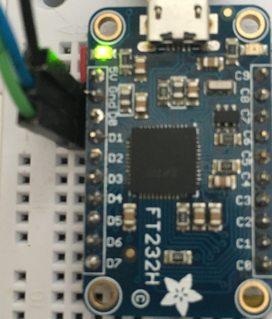
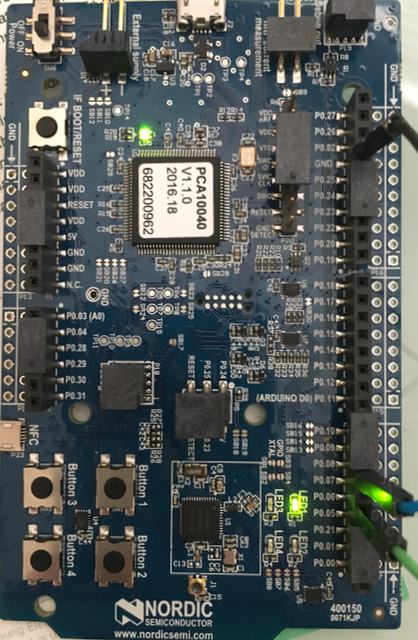
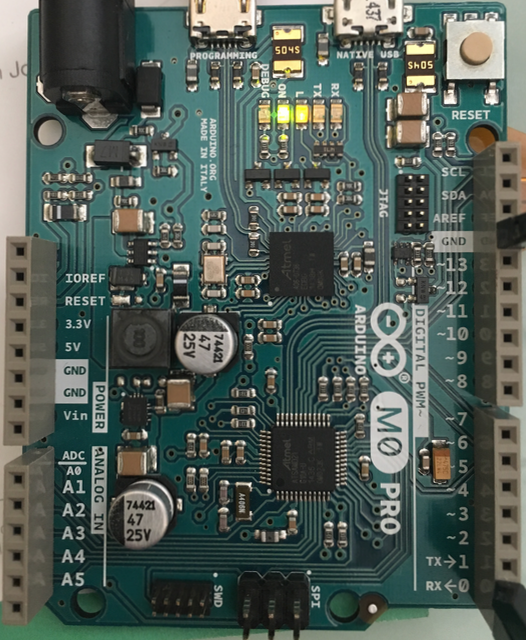

# Using the Serial Port with Mynewt OS

Some of the projects and tutorials here will allow you to use a serial port
to interact with your Mynewt project. While most modern PCs and laptops
no longer have a true serial port, almost all can use their USB ports
as serial ports. 

This will show you how to connect to some of the development boards
we use via a serial port. 

The development boards covered here are:

* Nordic Semiconductor NRF52dk
* Arduino M0 Pro

In order to communicate with these boards you will also need a USB<-->Serial
converted. We'll be using the [AdaFruit FT232H Breakout Board](https://www.adafruit.com/products/2264) for
this, but almost any similar board should work just as well. You will also
need Minicom or a similar Serial communications application. We'll show you how
to use the `screen` command built in to Mac OS X, but later tutorials will
also show Minicom setup.

So let's get started!

<br>

## Setup FT232H 

This is a great board because it's so easy to set up, and it can do Serial UART,
SPI, I2C and GPIO as well. There's full documentation on the board [here](https://learn.adafruit.com/adafruit-ft232h-breakout/overview)
 but we're only covering the wiring for the Serial UART. 
 
Start by connecting a jumper wire to Pin D0. This will be the UART Tx pin, 
which we'll then connect to the Rx pin on the Development Board.

Next connect a jumper wire to pin D1. This will be the UART Rx pin,
which we'll connect to the Tx pin on the development board.

Finally connect a jumper wire to the GND pin.

It should look like this:



<br>

## Setup Nordic Semiconductor NRF52DK

On the NRF52DK developer kit board, the Rx pin is P0.08, so you'll attach your
jumper wire from the Tx pin (D0) of the FT232H board here.

The TX Pin is pin P0.06, so you'll attache the jumper wire from the Rx Pin (D1)
on the FT232H board here. 

Finally, the GND wire should go to the GND Pin on the NRF52DK. When you're
done, your wiring should look like this:

 

<br>

## Setup Arduino M0 Pro

On the Arduino M0 Pro, the Tx and Rx pins are clearly labeled as such, as is the GND
pin. Just make sure you wire Rx from the FT232H to TX on the M0 Pro, and vice-versa.

Your Arduino M0 Pro should look like this:



<br>

## Setup Serial Communications
You will need to know the serial port to connect to and use a terminal program to connect to the board.

### Example for Mac OS  and Linux Platforms
First check what USB devices are already connected before connecting the FT232H board to your computer.  The ports are listed in the **/dev** directory and the format of the port name is platform dependent:

* Mac OS uses the format `tty.usbserial-<some identifier>`. 
* Linux uses the format `TTYUSB<N>`, where `N` is a number.  For example, TTYUSB2.

<br>
This example is run on a Mac OS system. 

Check what USB devices are already connected:
<br>
```no-highlight
$ ls -la /dev/*usb*
0 crw-rw-rw-  1 root  wheel   20,  63 Nov 23 11:13 /dev/cu.usbmodem401322
0 crw-rw-rw-  1 root  wheel   20,  62 Nov 23 11:13 /dev/tty.usbmodem401322
$
```
<br>
Plug in the FT232H board and check the ports again:
<br>
```no-highlight
$ ls -la /dev/*usb*
0 crw-rw-rw-  1 root  wheel   20,  63 Nov 23 11:13 /dev/cu.usbmodem401322
0 crw-rw-rw-  1 root  wheel   20,  65 Nov 23 11:26 /dev/cu.usbserial-0020124
0 crw-rw-rw-  1 root  wheel   20,  62 Nov 23 11:13 /dev/tty.usbmodem401322
0 crw-rw-rw-  1 root  wheel   20,  64 Nov 23 11:26 /dev/tty.usbserial-0020124
$
```
<br>
The FT232H is connected to `/dev/tty.usbserial-0020124` (The number after tty.usbserial will be different on your machine.)
<br>
Use the screen command to connect to the board: 
<br>
```
$ screen /dev/tty.usbserial-0020124 115200
```
<br>
To exit out of `screen` you'll type `control-A` followed by `control-\` and you'll
be back to a terminal prompt.

<br>

You can also use minicom:
<br>
```
$ minicom -D /dev/tty.usbserial-0020124

Welcome to minicom 2.7

OPTIONS: 
Compiled on Nov 24 2015, 16:14:21.
Port /dev/tty.usbserial-0020124, 09:57:17

Press Meta-Z for help on special keys
```
<br>
If there's no Mynewt app running, or the Mynewt app doesn't have the Shell and Console
enabled, you won't see anything there, but you can always refer back to this page
from later tutorials if you need to.

<br>

### Example for Windows Platforms

First check what USB devices are already connected before connecting the FT232H board to your computer.  You can locate the ports from a MinGW terminal or use the Windows Device Manager. 

On a MinGW terminal, the ports are listed in the /dev directory and the format of the port name is `ttyS<N>` where N is a number. You must map the port name to a Windows COM port: `/dev/ttyS<N>` maps to `COM<N+1>`. For example, `/dev/ttyS2` maps to  `COM3`.

Check what USB devices are already connected:
<br>
```no-highlight
$ls -l /dev/ttyS* 
crw-rw-rw- 1 <user> None 117, 5 May  9 04:24 /dev/ttyS5
$
```
<br>
/dev/ttyS5 maps to the Windows COM6 port. You can run Windows Device Manager to confirm:

<br>


<br>

Plug in the FT232H board and check the ports again:
<br>
```no-highlight
$ls -l /dev/ttyS* 
ls -l /dev/ttyS*
crw-rw-rw- 1 <user> None 117, 10 May  9 04:55 /dev/ttyS10
crw-rw-rw- 1 <user> None 117,  5 May  9 04:55 /dev/ttyS5
$
```	
<br>
The FT232H board is connected to port /dev/ttyS10 (or COM11):

<br>


<br>

We use the PuTTY terminal application to connect to the board on the COM11 port:
<br>


<br>

Press Open and you should get a terminal screen titled "COM11 - PuTTY"


If there's no Mynewt app running, or the Mynewt app doesn't have the Shell and Console
enabled, you won't see anything there, but you can always refer back to this page
from later tutorials if you need to.

<br>

Now that you know how to communicate with your mynewt application, let's move on to
creating one!
